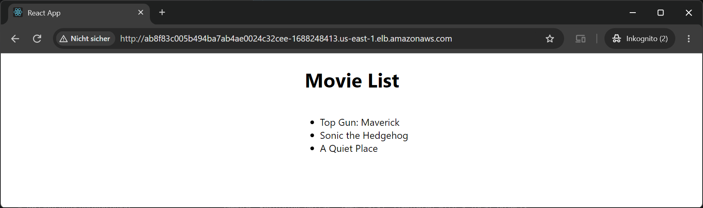
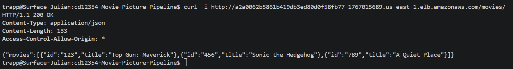
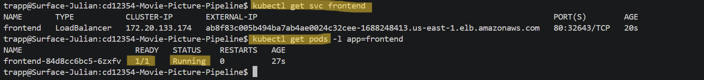
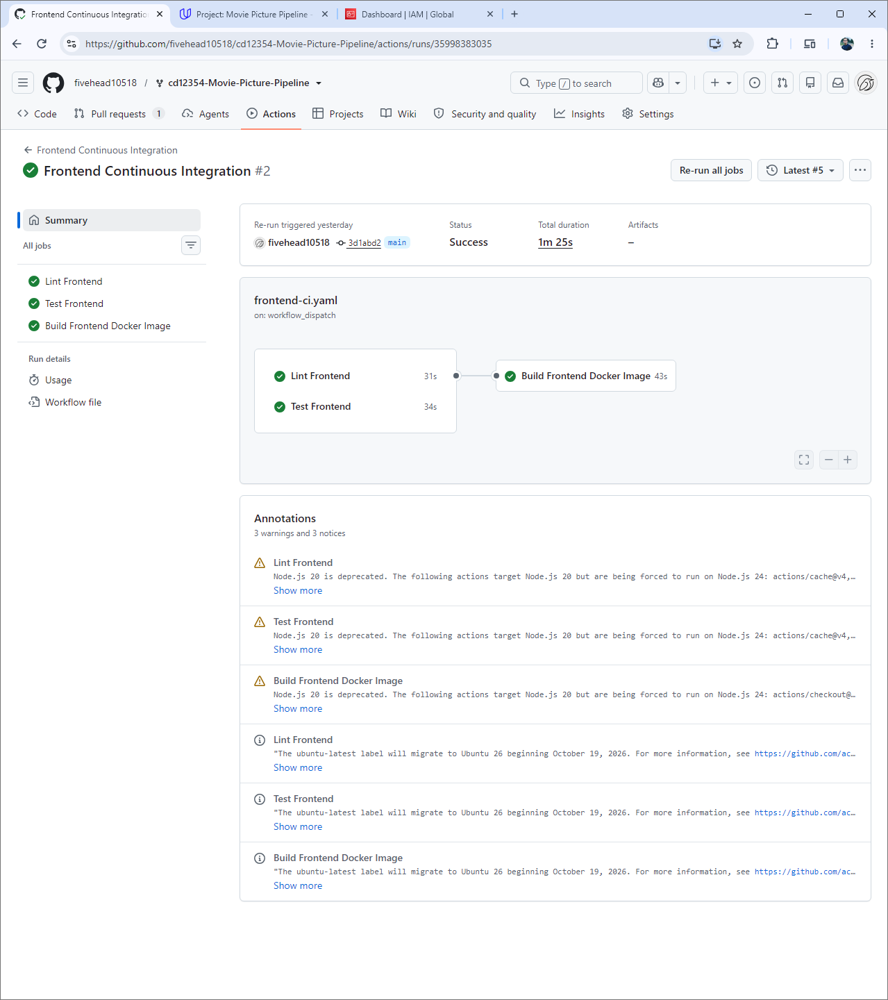
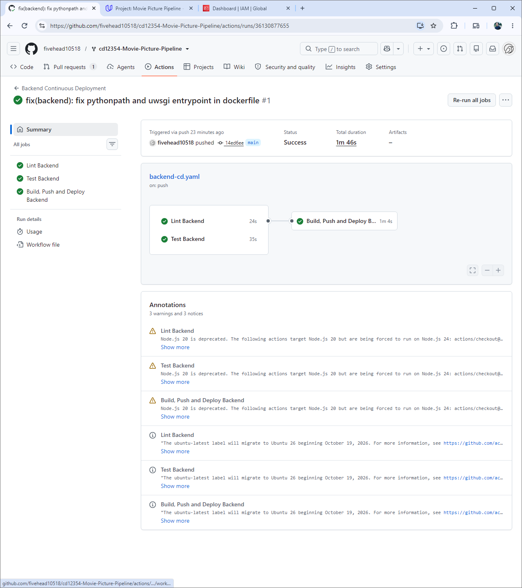
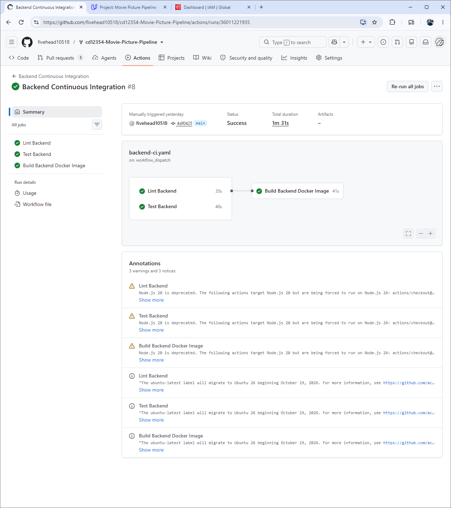
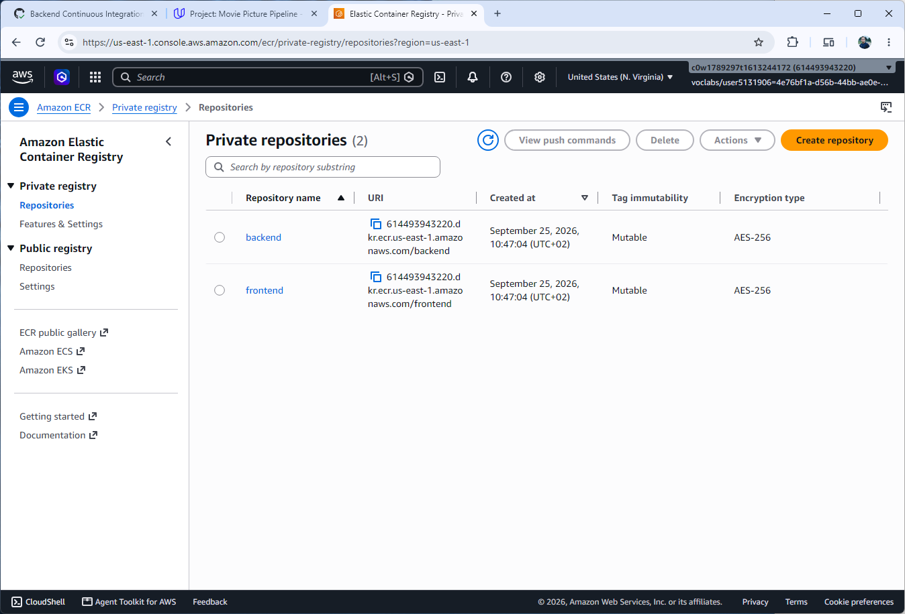

# Movie Picture Pipeline

### Run Tests Locally
```bash
cd backend && pipenv run test
cd backend && pipenv run lint
```
```bash
cd frontend && npm run test
cd frontend && npm run lint
```

### Build and Run with Docker Locally
#### Backend
```bash
cd backend
docker build -t mp-backend:local .
docker run --rm --name mp-backend -p 5000:5000 mp-backend:local
```
#### Frontend
```bash
cd frontend
docker build --build-arg REACT_APP_MOVIE_API_URL=http://localhost:5000 -t mp-frontend:local .
docker run --rm --name mp-frontend -p 3000:3000 mp-frontend:local
```
#### Delete containers after testing
```bash
docker stop mp-backend mp-frontend
```

## Deploy to AWS EKS
### Backend
```bash
cd backend
docker build --tag mp-backend:latest .
# Tag and push to ECR
aws ecr get-login-password --region us-east-1 | docker login --username AWS --password-stdin <account>.dkr.ecr.us-east-1.amazonaws.com
docker tag mp-backend:latest <account>.dkr.ecr.us-east-1.amazonaws.com/mp-backend:latest
docker push <account>.dkr.ecr.us-east-1.amazonaws.com/mp-backend:latest

# Deploy
cd k8s
kustomize edit set image backend=<account>.dkr.ecr.us-east-1.amazonaws.com/mp-backend:latest
kustomize build | kubectl apply -f -
```

### Frontend
```bash
cd frontend
export REACT_APP_MOVIE_API_URL=http://<backend-alb-url>
docker build --build-arg=REACT_APP_MOVIE_API_URL=$REACT_APP_MOVIE_API_URL --tag mp-frontend:latest .
# Tag and push to ECR
docker tag mp-frontend:latest <account>.dkr.ecr.us-east-1.amazonaws.com/mp-frontend:latest
docker push <account>.dkr.ecr.us-east-1.amazonaws.com/mp-frontend:latest

# Deploy
cd k8s
kustomize edit set image frontend=<account>.dkr.ecr.us-east-1.amazonaws.com/mp-frontend:latest
kustomize build | kubectl apply -f -
```

## Verify Deployment

```bash
# Check pods
kubectl get pods -n default

# Check services
kubectl get svc -n default

# Get frontend URL
kubectl get svc frontend -n default -o jsonpath='{.status.loadBalancer.ingress[0].hostname}'

# Test backend API
curl http://<backend-alb-url>/movies
```

## Destroy Infrastructure

```bash
# Delete Kubernetes resources first
kubectl delete -k frontend/k8s
kubectl delete -k backend/k8s

# Wait until the frontend and backend LoadBalancer services are deleted.
kubectl get svc

# Destroy AWS infrastructure
cd setup/terraform
terraform destroy
```

## Project Deliverables
**Frontend Live View**


**Backend API Response**


**Kubernetes Cluster Status**


**GitHub Actions Pipelines**





**Amazon ECR Repositories**
